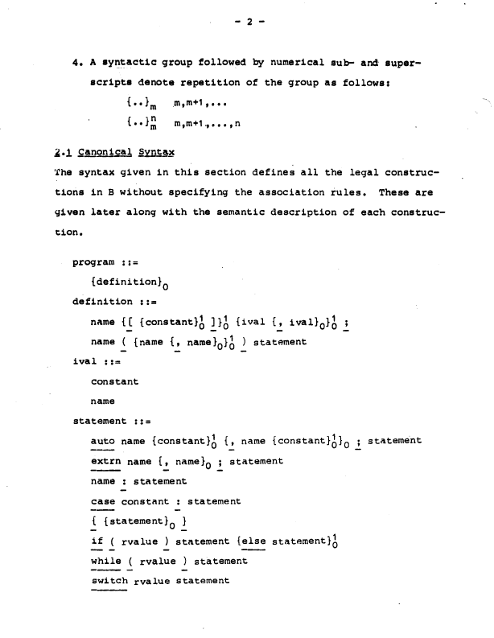
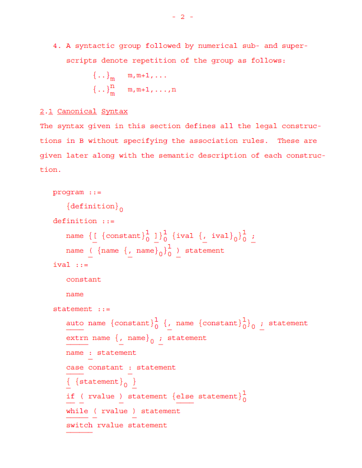
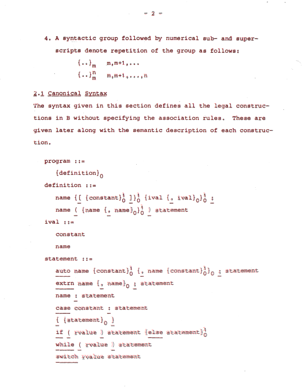

# Re-Setting *Users' Reference to B*
This is my attempt at faithfully re-setting Ken Thompson's Bell Labs memo, *Users' Reference to B*, while preserving its original formatting as closely as possible.

# OCR Process
I grabbed the [original PDF](https://www.nokia.com/bell-labs/about/dennis-m-ritchie/kbman.pdf) from [Dannis Ritchie's website](https://www.nokia.com/bell-labs/about/dennis-m-ritchie) and removed previous OCR attempts. Using Adobe Acrobat Pro, one of the best commercial PDF editors available, I re-OCRed the document and exported the results to a text file.

# Converting to ROFF
Next, I converted the OCR output into ROFF by inserting control lines, though I made no attempt to replicate the style of the original ROFF sources. The ROFF files were processed using `roff(1)` from UNIX V2, with the output captured in [`kbman_text`](./kbman_text).

However, the resulting text didn't match the original due to hyphenation differences. These differences were caused by changes in the suffix table over time. I used the earliest available suffix table from 28 March 1972, but since the memo dates back to 7 January 1972, it was undoubtedly typeset using an even earlier version. I manually corrected the hyphenation in the `roff(1)` output to match the original text.

# Comparison
To ensure accuracy, I typeset the edited `roff(1)` output using my [Teletype Model 37 PDF simulator](https://github.com/TheBrokenPipe/Teletype-37-PDF) in debug mode (red text) and compared it to the original PDF. Each page was layered in Adobe Photoshop, with the re-set version placed over the original at 50% opacity. I manually adjusted the text until both versions matched exactly, fixing all OCR errors (e.g., missing spaces, incorrect characters, `0` vs `o`, `1` vs `l`) in the process.

|  |  |  |
| -------- | ------ | -------- |

Left - original 
Middle - re-set 
Right - combined

# Final Output
After completing the corrections, I generated the final PDF ([`kbman_re-set.pdf`](./kbman_re-set.pdf)) in black text by disabling debug mode. The document was then cleaned up and optimised.
